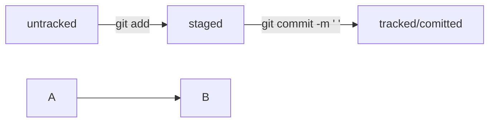

# Дополняемая шпаргалка по GIT
### Навигация

- `pwd` (от англ. ***p**rint **w**orking **d**irectory*, «показать рабочую папку») — покажи, в какой я папке;
- `ls` (от англ. ***l**i**s**t directory contents*, «отобразить содержимое директории») — покажи файлы и папки в текущей папке;
- `ls -a` — покажи также скрытые файлы и папки, названия которых начинаются с символа `.`;
- `cd first-project` (от англ. ***c**hange **d**irectory*, «сменить директорию») — перейди в папку `first-project`;
- `cd first-project/html` — перейди в папку `html`, которая находится в папке `first-project`;
- `cd ..` — перейди на уровень выше, в родительскую папку;
- `cd ~` — перейди в домашнюю директорию (`/Users/Username`);
- `cd /` — перейди в корневую директорию.

### Работа с файлами и папками

**Создание**

- `touch index.html` (англ. *touch,* «коснуться») — создай файл `index.html` в текущей папке;
- `touch index.html style.css script.js` — если нужно создать сразу несколько файлов, можно напечатать их имена в одну строку через пробел;
- `mkdir second-project` (от англ. ***m**a**k**e **dir**ectory*, «создать директорию») — создай папку с именем `second-project` в текущей папке.

**Копирование и перемещение**

- `cp file.txt ~/my-dir` (от англ. ***c**o**p**y*, «копировать») — скопируй файл в другое место;
- `mv file.txt ~/my-dir` (от англ. ***m**o**v**e*, «переместить») — перемести файл или папку в другое место.

**Чтение**

- `cat file.txt` (от англ. *con**cat**enate and print*, «объединить и распечатать») — распечатай содержимое текстового файла `file.txt`.

**Удаление**

- `rm about.html` (от англ. ***r**e**m**ove*, «удалить») — удали файл `about.html`;
- `rmdir images` (от англ. ***r**e**m**ove **dir**ectory*, «удалить директорию») — удали папку `images`;
- `rm -r second-project` (от англ. ***r**e**m**ove,* «удалить» + ***r**ecursive*, «рекурсивный») — удали папку `second-project` и всё, что она содержит.

### Полезные возможности

- Команды необязательно печатать и выполнять по очереди. Можно указать их списком — разделить двумя амперсандами (`&&`).
- У консоли есть собственная память — буфер с несколькими последними командами. По ним можно перемещаться с помощью клавиш со стрелками вверх (**`↑`**) и вниз (**`↓`**).
- Чтобы не вводить название файла или папки полностью, можно набрать первые символы имени и дважды нажать `Tab`. Если файл или папка есть в текущей директории, командная строка допишет путь сама.
    
    Например, вы находитесь в папке `dev`. Начните вводить `cd first` и дважды нажмите `Tab`. Если папка `first-project` есть внутри `dev`, командная строка автоматически подставит её имя. Останется только нажать `Enter`.
    
### Известные команды Git

- `git init` инициализирует git в папке.
- `git add .` добавляет новые/измененные файлы в "корзину" перед коммитом (снимком).
- `git commit -m '...'` так называемый коммит, окончательное фиксирование изменений файлов. `-m` описание коммита.
- `git push -u origin master` отправляет изменения на удалённый репозиторий, после первого раза можно писать просто `git push`.

### Создание SSH ключей
- `cd ~` перешли в домашнюю директорию.
- `ssh-keygen -t ed25519 -C` "электронная почта, к которой привязан ваш аккаунт на GitHub".
- скопировать содержимое ключа в буфер обмена:
`pbcopy < ~/.ssh/id_rsa.pub`.
- для ed25519:
`pbcopy < ~/.ssh/id_ed25519.pub`.
- `ssh -T git@github.com` проверка правильности ключа.

### Хеш
- Хеширование (от англ. hash, «рубить», «крошить», «мешанина») — это способ преобразовать набор данных и получить их «отпечаток» (англ. fingerprint).
    Хеш одного и того же файла на разных компьютерах будет совпадать всегда.
- Основной идентификатор коммита - хеш.
- Таблица соответствия `хеш → информация о коммите` хранится в папке `.git`.

### Элементы, из которых состоит описание `git log`
- Строка из цифр и латинских букв после слова commit — это хеш коммита;
- Author — имя автора и его электронная почта;
- Date — дата и время создания коммита;
- В конце находится сообщение коммита.
- Получить сокращённый лог — `git log --oneline`.

### Файл HEAD

- Файл HEAD (англ. «голова», «головной») — один из служебных файлов папки .git. Он указывает на коммит, который сделан последним (то есть на самый новый).

```bash
$ cat refs/heads/master # взяли ссылку из файла HEAD
# внутри хеш
e007f5035f113f9abca78fe2149c593959da5eb7

$ git log 
# сверяем с хешем последнего коммита
commit e007f5035f113f9abca78fe2149c593959da5eb7
Author: John Doe <johndoe@example.com>
Date:   Tue Mar 28 00:26:53 2023 +0300

    Добавить амбиций в список дел

... # другие коммиты
```

### Статусы `untracked`/`tracked`, `staged` и `modified`


### Mermaid - схема
HEAD -- это голова.
Коммит -- это всему голова.
- Два символа `%%` обозначают в mermaid строку-комментарий.
- Необходимо указать формат: `graph LR`, для создания схемы. Graph — это простейший тип схем.
- Для добавления элементов и связи (стрелки), используют строки вида `A --> B`. Эта строка создаст квадратные блоки A и B и соединит их стрелкой.
- Текст можно указать на стрелке. `A -- "text" --> B`.

### Схема статусов файлов



### Инициализация репозитория

- `git init` (от англ. initialize, «инициализировать») — инициализируй репозиторий.

### Синхронизация локального и удалённого репозиториев

- `git remote add origin https://github.com/YandexPracticum/first-project.git` (от англ. remote, «удалённый» + add, «добавить») — привяжи локальный репозиторий к удалённому с URL https://github.com/YandexPracticum/first-project.git;
- `git remote -v` (от англ. verbose, «подробный») — проверь, что репозитории действительно связались;
- `git push -u origin main` (от англ. push, «толкать») — в первый раз загрузи все коммиты из локального репозитория в удалённый с названием origin.
## `💡 Ваша ветка может называться master, а не main. Подправьте команду, если это необходимо.`
- `git push` (от англ. push, «толкать») — загрузи коммиты в удалённый репозиторий после того, как он был привязан с помощью флага -u.
### Подготовка файла к коммиту

- `git add todo.txt` (от англ. add, «добавить») — подготовь файл todo.txt к коммиту;
- `git add --all` (от англ. add, «добавить» + all, «всё») — подготовь к коммиту сразу все файлы, в которых были изменения, и все новые файлы;
- `git add .` — подготовь к коммиту текущую папку и все файлы в ней.
### Создание и публикация коммита

- `git commit -m "Комментарий к коммиту."` (от англ. commit, «совершать», фиксировать» + message, «сообщение») — сделай коммит и оставь комментарий, чтобы было проще понять, какие изменения сделаны;
- `git push` (от англ. push, «толкать») — добавь изменения в удалённый репозиторий.
### Просмотр информации о коммитах

- `git log` (от англ. log, «журнал [записей]») — выведи подробную историю коммитов;
- `git log --oneline` (от англ. log, «журнал [записей]» + oneline, «одной строкой») — покажи краткую информацию о коммитах: сокращённый хеш и сообщение.
### Просмотр состояния файлов

- `git status` (от англ. status, «статус», «состояние») — покажи текущее состояние репозитория.
### Добавление изменений в последний коммит

- `git commit --amend --no-edit` (от англ. amend, «исправить») — добавь изменения к последнему коммиту и оставь сообщение прежним;
- `git commit --amend -m "Новое сообщение"` — измени сообщение к последнему коммиту на Новое сообщение.
## `💡 Выйти из редактора Vim: нажать Esc, ввести :qa!, нажать Enter.`
### «Откат» файлов и коммитов

- `git restore --staged hello.txt` (от англ. restore, «восстановить») — переведи файл hello.txt из состояния staged обратно в untracked или modified;
- `git restore hello.txt` — верни файл hello.txt к последней версии, которая была сохранена через git commit или git add;
- `git reset --hard b576d89` (от англ. reset, «сброс», «обнуление» + hard, «суровый») — удали все незакоммиченные изменения из staging и «рабочей зоны» вплоть до указанного коммита.
### Просмотр изменений

- `git diff` (от англ. difference, «отличие», «разница») — покажи изменения в «рабочей зоне», то есть в modified-файлах;
- `git diff a9928ab 11bada1` — выведи разницу между двумя коммитами;
- `git diff --staged` — покажи изменения, которые добавлены в staged-файлах.
