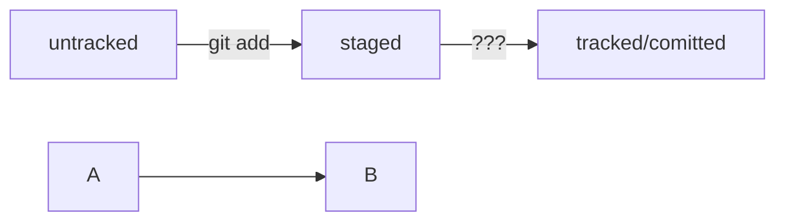

# Дополняемая шпаргалка по GIT
### Навигация

- `pwd` (от англ. ***p**rint **w**orking **d**irectory*, «показать рабочую папку») — покажи, в какой я папке;
- `ls` (от англ. ***l**i**s**t directory contents*, «отобразить содержимое директории») — покажи файлы и папки в текущей папке;
- `ls -a` — покажи также скрытые файлы и папки, названия которых начинаются с символа `.`;
- `cd first-project` (от англ. ***c**hange **d**irectory*, «сменить директорию») — перейди в папку `first-project`;
- `cd first-project/html` — перейди в папку `html`, которая находится в папке `first-project`;
- `cd ..` — перейди на уровень выше, в родительскую папку;
- `cd ~` — перейди в домашнюю директорию (`/Users/Username`);
- `cd /` — перейди в корневую директорию.

### Работа с файлами и папками

**Создание**

- `touch index.html` (англ. *touch,* «коснуться») — создай файл `index.html` в текущей папке;
- `touch index.html style.css script.js` — если нужно создать сразу несколько файлов, можно напечатать их имена в одну строку через пробел;
- `mkdir second-project` (от англ. ***m**a**k**e **dir**ectory*, «создать директорию») — создай папку с именем `second-project` в текущей папке.

**Копирование и перемещение**

- `cp file.txt ~/my-dir` (от англ. ***c**o**p**y*, «копировать») — скопируй файл в другое место;
- `mv file.txt ~/my-dir` (от англ. ***m**o**v**e*, «переместить») — перемести файл или папку в другое место.

**Чтение**

- `cat file.txt` (от англ. *con**cat**enate and print*, «объединить и распечатать») — распечатай содержимое текстового файла `file.txt`.

**Удаление**

- `rm about.html` (от англ. ***r**e**m**ove*, «удалить») — удали файл `about.html`;
- `rmdir images` (от англ. ***r**e**m**ove **dir**ectory*, «удалить директорию») — удали папку `images`;
- `rm -r second-project` (от англ. ***r**e**m**ove,* «удалить» + ***r**ecursive*, «рекурсивный») — удали папку `second-project` и всё, что она содержит.

### Полезные возможности

- Команды необязательно печатать и выполнять по очереди. Можно указать их списком — разделить двумя амперсандами (`&&`).
- У консоли есть собственная память — буфер с несколькими последними командами. По ним можно перемещаться с помощью клавиш со стрелками вверх (**`↑`**) и вниз (**`↓`**).
- Чтобы не вводить название файла или папки полностью, можно набрать первые символы имени и дважды нажать `Tab`. Если файл или папка есть в текущей директории, командная строка допишет путь сама.
    
    Например, вы находитесь в папке `dev`. Начните вводить `cd first` и дважды нажмите `Tab`. Если папка `first-project` есть внутри `dev`, командная строка автоматически подставит её имя. Останется только нажать `Enter`.
    
### Известные команды Git

- `git init` инициализирует git в папке.
- `git add .` добавляет новые/измененные файлы в "корзину" перед коммитом (снимком).
- `git commit -m '...'` так называемый коммит, окончательное фиксирование изменений файлов. `-m` описание коммита.
- `git push -u origin master` отправляет изменения на удалённый репозиторий, после первого раза можно писать просто `git push`.

### Создание SSH ключей
- `cd ~` перешли в домашнюю директорию.
- `ssh-keygen -t ed25519 -C` "электронная почта, к которой привязан ваш аккаунт на GitHub".
- скопировать содержимое ключа в буфер обмена:
`pbcopy < ~/.ssh/id_rsa.pub`.
- для ed25519:
`pbcopy < ~/.ssh/id_ed25519.pub`.
- `ssh -T git@github.com` проверка правильности ключа.

### mermaid - схема
HEAD -- это голова.
Коммит -- это всему голова.
Статусы файлов:
<тут пустая строка!>

```mermaid
%% описание схемы
```
<и тут пустая строка!>

### Схема статусов файлов

